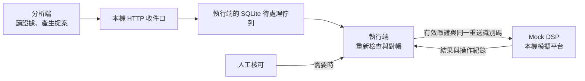

# 廣告預算調整 Agent 示範

這個專案示範一個 agent（依資料分析並提出動作的自動程式）如何在**不能信任提案或模型輸出**的前提下，安全地處理加預算建議。[分析規則](src/rtb/analyzer/policy.py)目前依模擬廣告數據產生提案；廣告平台是**本機模擬的 Mock DSP，不是真實廣告平台**。DSP 指廣告需求方平台，這裡只用它模擬廣告投放介面。[模擬平台](src/rtb/dsp/server.py)

- 分析端讀廣告現況與指標，依明確規則決定是否提案；寫入前由另一個行程重新檢查。[分析流程](src/rtb/analyzer/flow.py) · [執行流程](src/rtb/executor/execution.py)
- 提案、外部寫入與確認各自留下持久紀錄，讓逾時、當機與重送後仍能對帳。[任務紀錄](src/rtb/analyzer/task_store.py) · [寫入紀錄](src/rtb/executor/attempt_store.py)
- 模型目前只接入**離線評估的候選判斷**；正式決策路徑沒有採用模型候選。原因假說與給人的風險說明仍屬 Phase 11B 後續工作。[決策路由](src/rtb/analyzer/policy.py) · [Phase 11B 計劃](docs/rtb-production-agent-demo-knowledge/Projects/RTB_Phase11B大模型接入_計劃.md)

## 系統怎麼運作


動圖逐步亮起主線；想一次看清主線加上 F6、F7 兩條人工回頭線，可開啟 [SVG 靜態總覽圖](docs/assets/agent-flow.svg)。依 [Phase 11B 增量 2 計劃](docs/rtb-production-agent-demo-knowledge/Projects/RTB_Phase11B大模型接入_計劃.md)，圖中灰色的 AI 說明會在送件後另行產生，供核可者參考；目前正式分析流程尚未接入，模型候選仍只用於離線評估。[Phase 12 展示頁與伺服器](docs/rtb-production-agent-demo-knowledge/Verification/Phase12增量1驗收紀錄.md)也還沒上主線。

這裡的「佇列」是 SQLite 資料表中的待處理工作，提供重新投遞；SQLite 是把資料存在本機檔案的資料庫。分析端與執行端是分開的行程，以本機 HTTP 收件口交接提案；HTTP 收件口是程式間送提案的網路入口。[分析任務表](src/rtb/analyzer/task_store.py) · [收件表](src/rtb/executor/inbox_store.py) · [收件口](src/rtb/executor/inbox_server.py)

| 角色 | 做什麼；不能做什麼 |
| --- | --- |
| 分析端 | 讀取證據、依規則產生提案；不能持有寫入簽章金鑰或直接改預算。[流程](src/rtb/analyzer/flow.py) · [邊界測試](tests/analyzer/test_boundaries.py) |
| 收件口 | 嚴格解析、去重並保存提案；不執行提案或呼叫廣告平台。[收件口](src/rtb/executor/inbox_server.py) |
| 執行端 | 重查權限、金額、版本、新鮮度與總曝險，通過後才拿寫入憑證呼叫平台；寫入憑證是限制能改哪個廣告與動作的通行證。不能照單執行提案。[執行流程](src/rtb/executor/execution.py) · [護欄](src/rtb/executor/guardrails.py) |
| Mock DSP | 在獨立行程模擬廣告平台，核對寫入憑證、版本與重送識別碼；不代替真實平台。[服務](src/rtb/dsp/server.py) · [儲存](src/rtb/dsp/store.py) |
| 人工 | 對超出自動額度的**特定提案**簽核可；核可不等於略過其他檢查。[核可](src/rtb/executor/approval.py) · [測試](tests/executor/test_approval.py) |



模型輸出不能簽發寫入憑證，也不能直接改廣告預算；目前的模型候選只在離線評估中執行。未來的模型文字接入點規劃為給人參考的說明或假說。[模型候選](src/rtb/eval/model_candidate.py) · [憑證簽發](src/rtb/executor/capability_signer.py) · [Phase 11B 計劃](docs/rtb-production-agent-demo-knowledge/Projects/RTB_Phase11B大模型接入_計劃.md)

## 五條安全宣稱與證據

每條宣稱都有一份 [JSON 證據清單](claims/)；JSON 是用欄位和清單存資料的文字格式，這些清單列出程式範圍與測試，不自填「通過」結果。[驗證器](tools/verify_claims.py)會檢查路徑、版本雜湊（檔案內容的指紋）、證據覆蓋等，再親自執行證據測試；[CI](.github/workflows/ci.yml)（推送後的自動檢查）執行同一條命令。這是**機械檢查**，證據是否充分仍需人工審查。[Phase 11 驗收](docs/rtb-production-agent-demo-knowledge/Verification/Phase11驗收紀錄.md)

- **冪等與結果不明：**冪等指同一工作重送也只生效一次；平台已提交卻逾時時，用原識別碼查證，不換碼重送。[清單](claims/idempotency-unknown-outcome.json) · [端到端測試](tests/executor/test_execution_e2e.py)
- **權限與護欄：**憑證須符合廣告、動作與租戶範圍；加額、過期決策或舊版本會在寫入前受檢查。[清單](claims/permission-guardrail.json) · [護欄測試](tests/executor/test_guardrails.py)
- **並行：**多個工作者同時處理同一提案時，只能完成一次寫入；舊版本須退回重新規劃。[清單](claims/concurrency.json) · [並行測試](tests/executor/test_multi_worker.py) · [重新規劃測試](tests/analyzer/test_f4_end_to_end.py)
- **提示注入：**廣告名稱等不可信文字不能改決策、擴大提案欄位或取得寫入金鑰。[清單](claims/prompt-injection.json) · [端到端測試](tests/analyzer/test_f5_end_to_end.py)
- **總曝險：**租戶 24 小時內的累積加額若再加一筆會超過門檻，就先待人工核可；並行工作者不能一起衝過門檻。[清單](claims/aggregate-blast-radius.json) · [端到端測試](tests/executor/test_f7_end_to_end.py)

## 七種事故情境

以下的端到端測試會把多個服務連起來，走完從提案到處置的流程。

- **F1 已寫入但回應逾時：**執行端記成結果不明，以原識別碼對帳，避免加兩次。[測試](tests/executor/test_execution_e2e.py)
- **F2 寫入後、確認前當機：**重啟後依持久紀錄恢復，不再產生第二次副作用。[測試](tests/executor/test_crash_recovery.py)
- **F3 同一工作重複投遞：**任務租約限制同時分析者，執行端去重；租約到期後仍可能重做分析。[測試](tests/analyzer/test_task_lease.py) · [執行測試](tests/executor/test_crash_recovery.py)
- **F4 提案依據的廣告版本已舊：**舊值不覆蓋新值，分析端另開接續任務讀現況再規劃。[測試](tests/analyzer/test_f4_end_to_end.py)
- **F5 廣告名稱藏指令：**不可信文字不進決策欄位，不能藉文字擴權或觸發未授權寫入。[測試](tests/analyzer/test_f5_end_to_end.py)
- **F6 死信工作重放：**死信（重試用盡而暫停的工作）須由管理指令逐筆重放，之後重驗版本、決策與權限；舊決策不直接寫入。[測試](tests/analyzer/test_f6_end_to_end.py)
- **F7 多筆小額加總超標：**下一筆會超過總額時待核可，剛好達門檻仍可通過。[測試](tests/executor/test_f7_end_to_end.py)

## 怎麼跑

需要 **Python 3.14**；[專案設定](pyproject.toml)與 [CI](.github/workflows/ci.yml)都以 3.14 執行。開發工具版本固定在 [requirements-dev.txt](requirements-dev.txt)。在 repo 根目錄依序執行：

```sh
python3.14 -m venv .venv
```

```sh
.venv/bin/python -m pip install -r requirements-dev.txt
```

快速跑領域層測試：

```sh
.venv/bin/python -m pytest -q tests/domain
```

完整測試與 [CI](.github/workflows/ci.yml)使用相同指令：

```sh
.venv/bin/python -m pytest -q
```

驗證五條宣稱：

```sh
.venv/bin/python tools/verify_claims.py claims/
```

跑「值不值得加預算」的離線評估，花費帳放在 `/tmp`：

```sh
PYTHONPATH=src .venv/bin/python -m rtb.eval.record --ledger /tmp/rtb-model-ledger.sqlite
```

模型預設採**錄製回應模式**，不會發出付費模型呼叫；此提交的[錄製目錄](recordings/model/README.md)尚無批次紀錄，因此評估會如實標示模型「沒量／沒有批次紀錄」。即時模式須明確開啟、提供展示編號，並先通過[本機實測命令列](src/rtb/modelverify.py)寫下啟用紀錄；本地帳本限制**每次展示 1 美元、每月 20 美元**的估算額度。[模式判定](src/rtb/modelclient.py) · [花費帳](src/rtb/modelledger.py) · [Phase 11B 計劃](docs/rtb-production-agent-demo-knowledge/Projects/RTB_Phase11B大模型接入_計劃.md)

目前沒有串起所有服務的單一啟動指令。展示驅動程式已能依序真跑 F1–F7 七個情境並在最後跑宣稱驗證器，但只由測試呼叫；可操作的展示頁面與伺服器還在開發。[展示驅動](src/rtb/demo/driver.py) · [Phase 12 增量 1 階段性驗收](docs/rtb-production-agent-demo-knowledge/Verification/Phase12增量1驗收紀錄.md)

## 專案結構

- [`src/rtb/analyzer/`](src/rtb/analyzer/)：分析任務、證據蒐集、決策規則與提案送件。
- [`src/rtb/domain/`](src/rtb/domain/)：提案、證據、任務狀態與確定性指標的資料規則。
- [`src/rtb/executor/`](src/rtb/executor/)：收件佇列、寫入護欄、核可、執行與對帳。
- [`src/rtb/dsp/`](src/rtb/dsp/)：獨立的本機模擬廣告平台。
- [`src/rtb/eval/`](src/rtb/eval/)：合成案例、評分與候選方案的離線比較。
- [`src/rtb/ops/`](src/rtb/ops/)：唯讀追蹤、指標與服務水準查詢。
- [`src/rtb/` 共用模組](src/rtb/)：HTTP、SQLite、模型用戶端與花費帳等共用基礎。
- [`tests/`](tests/)：單元、並行、故障與端到端測試；[`claims/`](claims/)：五條安全宣稱的證據清單；[`tools/`](tools/)：宣稱驗證與輔助工具。
- [`docs/assets/`](docs/assets/)：流程圖與重畫腳本；腳本是文件產出物，不算專案工具。
- [`docs/rtb-production-agent-demo-knowledge/`](docs/rtb-production-agent-demo-knowledge/MOC/index.md)：知識圖譜，以互相連結的 Systems（系統邊界）、Projects（計劃）、Verification（驗收）、Issues（待處理問題）補充程式碼看不出的脈絡；可從索引進入。
- [`governance/`](governance/)：設計與代碼審查留下的卷證。

## 做到哪裡

下列階段有各自標為通過的驗收紀錄；「完成」只指該紀錄列出的範圍。

- [Phase 1](docs/rtb-production-agent-demo-knowledge/Verification/Phase1驗收紀錄.md)：本機模擬平台與確定性指標計算。
- [Phase 2](docs/rtb-production-agent-demo-knowledge/Verification/Phase2驗收紀錄.md)：提案收件口、分析流程、檢查點與示範決策規則。
- [Phase 3](docs/rtb-production-agent-demo-knowledge/Verification/Phase3驗收紀錄.md)：寫入憑證、嘗試紀錄、單筆執行與結果不明對帳。
- [Phase 4](docs/rtb-production-agent-demo-knowledge/Verification/Phase4驗收紀錄.md)：佇列重新投遞、當機恢復與多工作者處理。
- [Phase 5](docs/rtb-production-agent-demo-knowledge/Verification/Phase5驗收紀錄.md)：舊版本寫入拒絕與重新規劃。
- [Phase 6](docs/rtb-production-agent-demo-knowledge/Verification/Phase6驗收紀錄.md)：權限護欄、總曝險預留與人工核可。
- [Phase 7](docs/rtb-production-agent-demo-knowledge/Verification/Phase7驗收紀錄.md)：不可信廣告文字與提案的信任邊界。
- [Phase 8](docs/rtb-production-agent-demo-knowledge/Verification/Phase8驗收紀錄.md)：死信重放與過時決策重驗。
- [Phase 9](docs/rtb-production-agent-demo-knowledge/Verification/Phase9驗收紀錄.md)：跨元件追蹤、指標與服務水準告警。
- [Phase 10](docs/rtb-production-agent-demo-knowledge/Verification/Phase10驗收紀錄.md)：單一判斷點的合成評估與採用決定。
- [Phase 11](docs/rtb-production-agent-demo-knowledge/Verification/Phase11驗收紀錄.md)：五份證據清單、宣稱驗證器與 CI 接線。

**階段性完成（只涵蓋增量 1）：**

- [Phase 11B 增量 1](docs/rtb-production-agent-demo-knowledge/Verification/Phase11B增量1驗收紀錄.md)：模型用戶端、本機 Claude Code 後端、花費帳與上限、評估的模型候選；還沒做過即時實測，正式決策路徑沒有採用模型。
- [Phase 12 增量 1](docs/rtb-production-agent-demo-knowledge/Verification/Phase12增量1驗收紀錄.md)：啟動器與驅動程式的程式庫（尚無使用者命令）、故障注入、分析端驅動與 F1–F7 真跑；展示頁面與伺服器還沒上主線。

**進行中：**Phase 12 的展示頁面與伺服器；[Phase 11B 計劃](docs/rtb-production-agent-demo-knowledge/Projects/RTB_Phase11B大模型接入_計劃.md)的增量 2（原因假說、給確認者的說明）。**規劃中：**讓 AI 在分析端參與「查什麼、要不要提案」的決策（金額與權限仍由程式與護欄把關）。

## 開發方式與限制

- 各階段先留下計劃，經設計審、代碼審、CI 與驗收紀錄；完整規則見 [AGENTS.md](AGENTS.md) 與 [CLAUDE.md](CLAUDE.md)。
- 這是本機單機示範：SQLite 佇列不是正式訊息系統，Mock DSP 不會碰真實廣告帳戶。[架構筆記](docs/rtb-production-agent-demo-knowledge/Projects/RTB_Agent_Phase0架構.md)
- 分析與執行的正常程式路徑分開，但同一作業系統使用者下並無強制隔離；本地花費帳的上限防忘記，不防刻意刪帳或改帳。[架構筆記](docs/rtb-production-agent-demo-knowledge/Projects/RTB_Agent_Phase0架構.md) · [Phase 11B 計劃](docs/rtb-production-agent-demo-knowledge/Projects/RTB_Phase11B大模型接入_計劃.md)
- 結果不明的對帳仰賴 Mock DSP 的作廢與依鍵查詢能力；真實平台不一定提供，換平台時須重驗。[Phase 3 驗收](docs/rtb-production-agent-demo-knowledge/Verification/Phase3驗收紀錄.md) · [Phase 5 驗收](docs/rtb-production-agent-demo-knowledge/Verification/Phase5驗收紀錄.md)
- 人工核可採對稱金鑰，執行端也讀得到核可金鑰，擋不住有權限的人自行簽核可。[核可模組](src/rtb/executor/approval.py) · [Phase 6 驗收](docs/rtb-production-agent-demo-knowledge/Verification/Phase6驗收紀錄.md)
- 24 小時曝險窗、加額比例上限五成、決策新鮮度 15 分鐘、租約 60 秒與投遞上限 5 都是暫用值，尚未實測校準；調整門檻時須按各驗收紀錄重驗。[Phase 6 驗收](docs/rtb-production-agent-demo-knowledge/Verification/Phase6驗收紀錄.md) · [Phase 8 驗收](docs/rtb-production-agent-demo-knowledge/Verification/Phase8驗收紀錄.md) · [Phase 4 驗收](docs/rtb-production-agent-demo-knowledge/Verification/Phase4驗收紀錄.md)
- F5 目前只驗程式規則路徑不受不可信廣告名稱影響，尚未驗模型是否會受騙；模型接入時須延伸端到端測試。[Phase 7 驗收](docs/rtb-production-agent-demo-knowledge/Verification/Phase7驗收紀錄.md) · [Phase 12 增量 1 驗收](docs/rtb-production-agent-demo-knowledge/Verification/Phase12增量1驗收紀錄.md)
- F7 端到端測試在 CI 偶爾超過 60 秒；CI 因這支超時紅燈時照使用者裁定重跑一次；同一週超過兩次再依追蹤問題重評。F7 效能改善另有分支實作中，尚未合入主線，設計見 [F7 效能計劃](docs/rtb-production-agent-demo-knowledge/Projects/F7效能_計劃.md)。[Phase 9 驗收](docs/rtb-production-agent-demo-knowledge/Verification/Phase9驗收紀錄.md) · [追蹤問題](docs/rtb-production-agent-demo-knowledge/Issues/F7端到端在CI上偶爾超過60秒.md)
