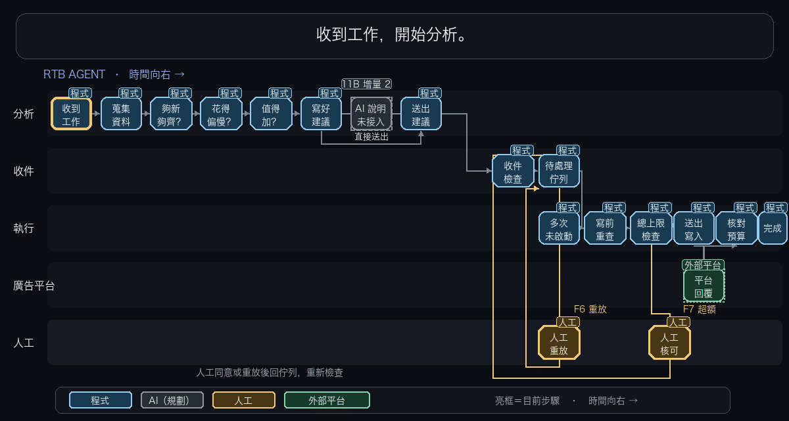

# 廣告預算調整 Agent

這是一套判斷廣告要不要加預算的 agent 工作流程。從分析、提案到寫入，每一步都有檢查。廣告平台是本機模擬的，不會碰真實帳戶。

## 怎麼運作

 [看靜態流程圖](docs/assets/agent-flow.svg)

分析端先檢查資料是否夠新、夠完整，以及預算是否花得偏慢。開啟 AI 判斷時，AI 可以選幾種唯讀查詢，再決定要不要提案。程式會核對它引用的資料，回答出錯就改用程式規則。提案金額始終由程式計算。提案送進待處理佇列後，執行端重查權限、版本、時效與金額，必要時等人工核可，最後才寫入模擬平台。

## 做了哪些把關

- 寫入結果不明時，用同一個識別碼查證，不另發一筆。
- 多個工作者同時處理同一份提案，平台也只會改一次。
- 執行前重查權限、版本與單筆加額限制，過時的提案會被擋下。
- 24 小時內累計加額超過上限，就先停下來等人核可。
- 廣告名稱裡藏的誘導文字，改不了提案金額、目標廣告或動作。
- 寫入後就算當機，也能依紀錄恢復，不會再寫一次。
- [安全宣稱清單](claims/)連到程式與測試證據，並由檢查工具自動核對。

展示備有七種故障情境，包含逾時、當機、重複投遞、舊版本、名稱誘導、人工重放和累計超額。[看展示流程](src/rtb/demo/flow.py)

## 跑起來看看

需要 Python 3.14。在 repo 根目錄安裝：

```sh
python3.14 -m venv .venv && .venv/bin/python -m pip install -r requirements-dev.txt
```

開展示：

```sh
PYTHONPATH=src .venv/bin/python -m rtb.demo.server --work-dir /tmp/rtb-demo --reports /tmp/rtb-demo-reports
```

跑測試：

```sh
.venv/bin/python -m pytest -q && .venv/bin/python tools/verify_claims.py claims/
```

展示預設播放錄好的 AI 回答，不會呼叫付費模型。啟動後終端機會印出 `PORT`，打開 `http://127.0.0.1:<PORT>` 就能跑七種情境。

想接真的模型跑（權杖用 `claude setup-token` 取得）：

```sh
export CLAUDE_CODE_OAUTH_TOKEN=<權杖>
PYTHONPATH=src .venv/bin/python -m rtb.modelverify
RTB_MODEL_LIVE=1 PYTHONPATH=src .venv/bin/python -m rtb.demo.server --work-dir /tmp/rtb-demo --reports /tmp/rtb-demo-reports --live F1,F5
```

## AI 表現與限制

在名稱正常的 36 筆合成案例中，AI 路徑的最後結論答對 17 筆，程式規則答對 12 筆。但 AI 的回答格式失敗率與延遲都沒過門檻，所以正式決策不採用 AI。展示裡仍看得到它怎麼判斷。[評估結果](governance/eval/phase13-investigation-adoption.md)

這是單機示範，不具備正式環境的行程隔離與訊息服務。
